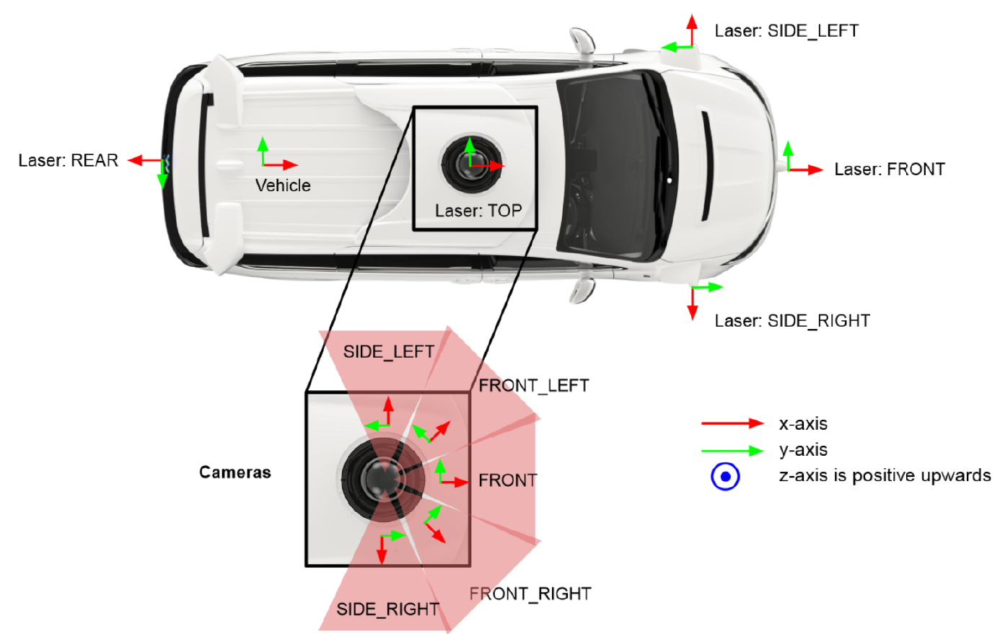

# 3D Pose Estimation for Autonomous Driving
This repository contains the code of my master thesis **"3D Human Pose Estimation for Autonomous Driving"**.

## Setup
First of all, you need to download the [Waymo-Open-Dataset](https://waymo.com/open/download/) from the official site.

Once the data is downloaded, copy this repo and install all dependencies in a virtual environment.
```
git clone https://github.com/ptr-br/3D_Pose_Estimation.git
cd 3D_Pose_Estimation/

# we used Python 3.8.10 & Linux 20
python -m venv waymo_env

# create environment and install requirements
source waymo_env/bin/activate
python -m pip install -r requirements.txt
```

Before the data can be used it has to be stored in a more PyTorch friendly manner.
```
python create_keypoint_dataset.py /data/waymo/v1.3.2/individual_files/ /media/petbau/data/waymo/v0.2/
```


## Data
For model training and testing we used the [Waymo-Open-Dataset](https://waymo.com/open/download/) that consists of 1950 segments 20sec each.

**Sensor Setup**
- 1 mid-range LiDAR (75m)
- 4 short range LIDAR's (20m)
- 5 cameras (front ans side)
- LiDAR to camera projections (do not align well up till now)


